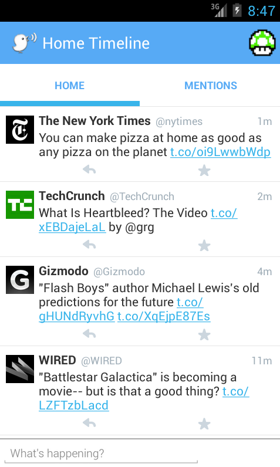
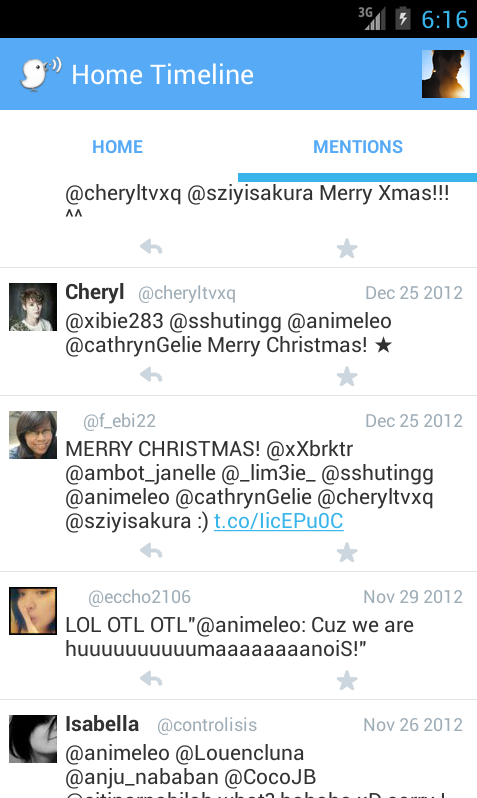

cpath-twitter-v2
=============

TheCodePath: Twitter App ver.2

Sample Images:

Completed Stories:

* All the required stories.
  * User can switch between Timeline and Mention views using tabs.
  * User can navigate to view their own profile.
  * User can click on the profile image in any tweet to see another user's profile.

* The following optional stories:
  * When a network request goes out, user sees an indeterminate progress indicator -- partial: only when retrieving tweets.
  * User can "reply" to any tweet on their home timeline
  * User can take favorite (and unfavorite) or reweet actions on a tweet -- partial: did the favorite/unfavorite part.
  * Improve the user interface and theme the app to feel twitter branded -- worked on the top part of the profile activity.